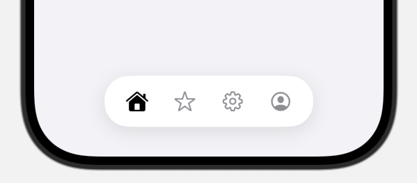

# FloatingTabKit
一个 SwiftUI 浮动标签栏组件，支持自定义背景、圆角、阴影，适配浅色/深色模式。可替代原生 `TabView`，让你的底部导航更灵动、更美观 ✨



## ✨ 功能亮点

- 🚀 支持任意数量的 Tab 页面,建议最大5个
- 🎨 自定义背景材质（颜色 / Material）
- 🟦 圆角 / 阴影样式可配置
- ✅ 默认高亮图标（SF Symbol `.fill` 样式）
- 🔄 支持外部绑定和监听当前选中 Tab（`selectedTab`）


## 📦 安装方式（使用 Swift Package Manager）

1. 打开 Xcode，点击菜单：`File > Add Packages...`
2. 粘贴仓库地址：

## 🧪 使用示例

```swift
import FloatingTabKit
//默认
struct FloatingTabExample: View {
    var body: some View {
        FloatingTabScaffold {
            FloatingTab("house") { HomeView() }
            FloatingTab("star") { FavoriteView() }
            FloatingTab("gearshape") { SettingsView() }
        }
    }
}
```
```
//外部可自定义参数写法

FloatingTabScaffold(
    background: AnyShapeStyle(Color.white),
    cornerRadius: 32,
    shadow: ShadowStyle(
        color: .black.opacity(0.2),
        radius: 12,
        x: 0,
        y: 4
    )
) {
    //tabs
}
```
```
//外部监听选中标签
@State private var selectedTab = 0

FloatingTabScaffold(
    selectedTab: $selectedTab,
    initialTab: 0, // 可选，默认 0
    background: AnyShapeStyle(.ultraThinMaterial),
    cornerRadius: 32
) {
    FloatingTab("house") { HomeView() }
    FloatingTab("star") { FavoriteView() }
    FloatingTab("gearshape") { SettingsView() }
}
.onChange(of: selectedTab) {
    triggerHapticFeedback() // 一些自定义的函数
}
```

## 🧱 参数说明

| 参数名        | 类型              | 描述                                             |
|---------------|-------------------|--------------------------------------------------|
| `background`  | `AnyShapeStyle`    | 底部栏背景样式，支持 `.material` 或 `Color`     |
| `cornerRadius`| `CGFloat`          | 底部栏圆角大小                                   |
| `shadow`      | `ShadowStyle`      | 控制阴影颜色、模糊半径、偏移量等                |
| `selectedTab`  | `Binding<Int>`     | 外部绑定当前选中标签页下标，用于监听切换         |
